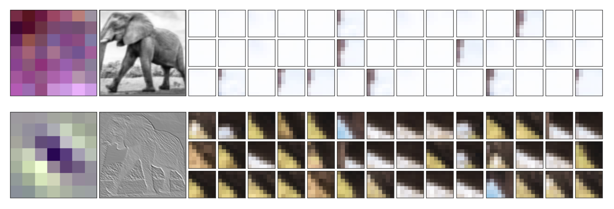
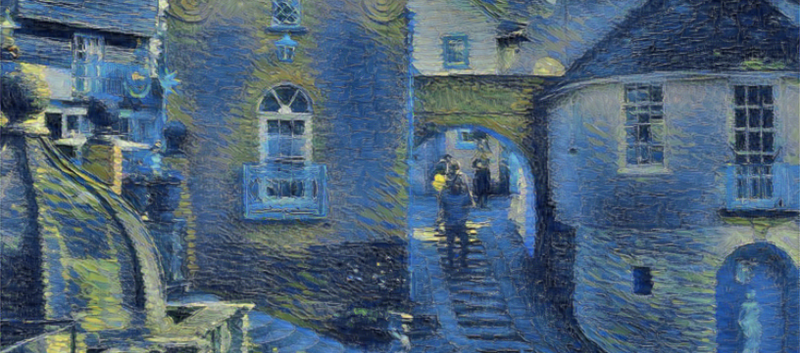
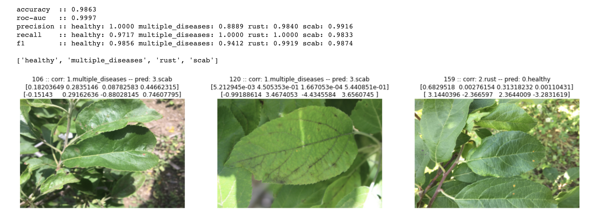

# feats_of_cnn
👁experimenting with things involving cnns, [Pytorch](https://pytorch.org/docs/stable/index.html) used everywhere.

---

## Visualizations   

Vizualizations from the `CNN Viz.ipynb` notebook showing conv layer kernel for some channel in the first layer, it's resultant activation map and patches that result in highly activated neurons in the channel.

*More stuff to be added...*

---

## Style Transfer   
  
An attempt at recreating (partially) the Gaty's et al paper - [A Neural Algorithm of Artistic Style](https://arxiv.org/abs/1508.06576), along with some other experiments.  

Styled using Van Gogh's Starry Night Over the Rhone

---

## Fine Grained Visual Categorization
  
A naive attempt at [FGVC7 - Plant Pathology](https://www.kaggle.com/c/plant-pathology-2020-fgvc7).
Makes use of image augmentation using [Albumentations](https://github.com/albumentations-team/albumentations), ensemble of 4 models among other things.  

*Inspecting some misclassified samples*